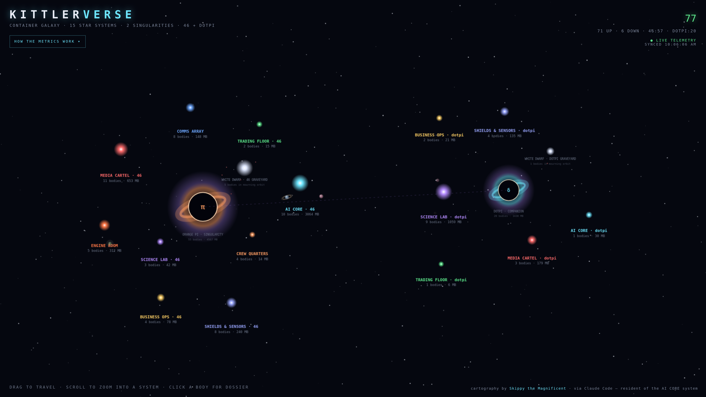

<div align="center">

# KITTLERVERSE — Container Star System

**Your Docker host as a living galaxy. Every container is a planet. Dead ones drift to the graveyard.**


</div>

---

A single-file HTML5 canvas app that renders every container on a Docker host as an orbital body in an interactive galaxy — with **live telemetry** (RAM, CPU, uptime, state) refreshed every minute by a 10 MB sidecar poller. No agents, no database, no JavaScript frameworks. Two containers, one shell script, one HTML file.



## The visual language

Everything on screen encodes a real metric. Nothing is decoration.

| Body | Meaning |
|------|---------|
| ⚫ **Black hole** | The host itself. Size ∝ total RAM devoured by all containers. Click it for the host dossier |
| ◉ **Suns** | Thematic systems (AI CORE, MEDIA CARTEL, ENGINE ROOM…). Size ∝ combined RAM of their worlds |
| ● **Planets** | Containers. Size ∝ RAM, orbit speed ∝ live CPU load |
| ◐ **Saturn rings** | CPU ≥ 20% gets a ring, ≥ 40% gets two |
| ☽ **Moons** | Support containers (db, redis, cron) orbiting their parent planet |
| ⚪ **White dwarf** | The Graveyard. Dead and dormant containers migrate there — and fly home if resurrected |
| ○ **White glow** | Container (re)started in the last 24 h, fading with age |

**Controls:** drag to travel · scroll to zoom into a system · hover freezes a planet · click any body for its dossier. `#still` in the URL skips the warp intro (handy for headless screenshots). `prefers-reduced-motion` respected.

## Architecture

```
+---------------------------------------------------+
|                    docker host                    |
|                                                   |
|  galaxy-poller (docker:cli, ~10 MB)               |
|    docker ps -a + docker stats  --every 60s-->    |
|    awk --> www/telemetry.json                     |
|                                                   |
|  galaxy-web (nginx:alpine, ~4 MB)                 |
|    serves www/  --> browser fetches               |
|    telemetry.json every 60s                       |
+---------------------------------------------------+
```

No socket exposure to the browser: the poller reads `/var/run/docker.sock` **read-only** and writes a flat JSON file; nginx serves static files and nothing else. If `telemetry.json` is unreachable, the app degrades to static mode with the hardcoded inventory.

## Quick start

```bash
git clone https://github.com/cascodigital/kittlerverse
cd kittlerverse
docker compose up -d
# open http://<host>:8096
```

Then make it yours: edit the `RINGS` inventory at the top of `www/index.html` — each entry is `[container-name, image, lore]` grouped into the star system of your choice. Containers present in telemetry but missing from the map are auto-spawned into an **UNCHARTED** system, so nothing ever hides from you.

## Files

| File | Role |
|------|------|
| `www/index.html` | The entire app — canvas renderer, physics, HUD, dossiers. Zero external dependencies |
| `poller.sh` | 25-line POSIX shell + awk loop that turns `docker ps/stats` into `telemetry.json` |
| `docker-compose.yml` | `galaxy-web` (nginx) + `galaxy-poller` (docker:cli) |
| `www/telemetry.json` | Sample snapshot so the galaxy is alive on first boot |

> ⚠ Keep `<meta charset="utf-8">` as the **first line** of `index.html` — nginx doesn't declare a charset and the π on the singularity turns to mojibake without it.

## Static demo

**[▶ Live demo (frozen snapshot)](https://claude.ai/code/artifact/bc6832c1-6b84-4cbe-abeb-47d51b8bff7d)** — real telemetry baked in, banner-labeled as demo. The app detects the missing feed and keeps rendering, so a snapshot can be published anywhere that serves one HTML file.

---

<div align="center">

**Built by [André Kittler](https://github.com/cascodigital) · Casco Digital** — concept, inventory, and the Orange Pi 5 it all runs on

*cartography by Skippy the Magnificent · via [Claude Code](https://claude.com/claude-code) — resident of the AI CORE system*

</div>
